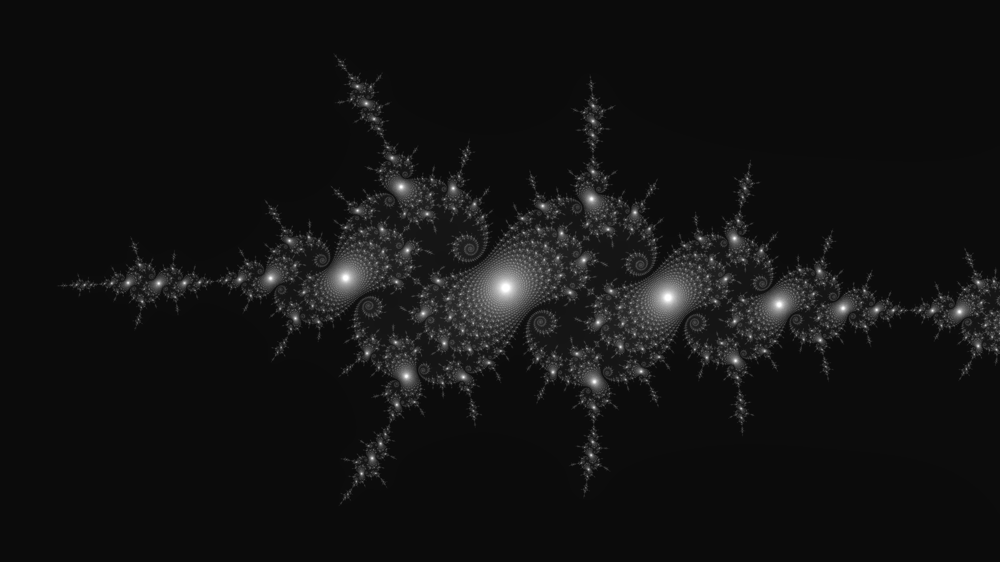
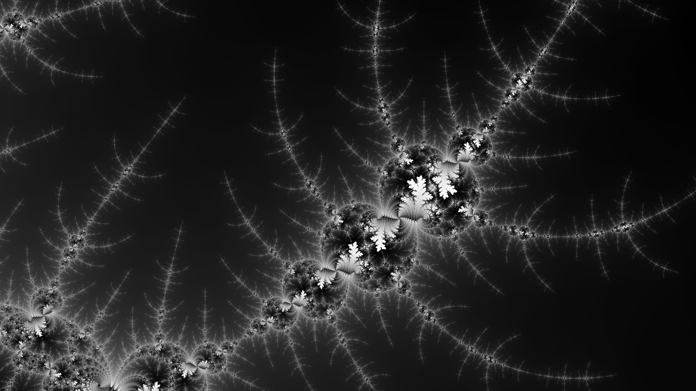
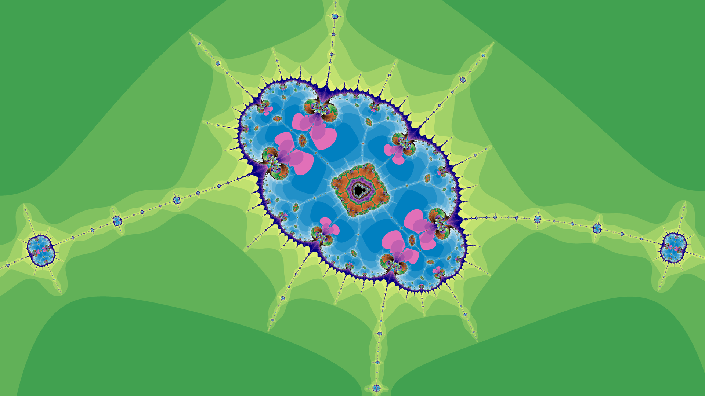
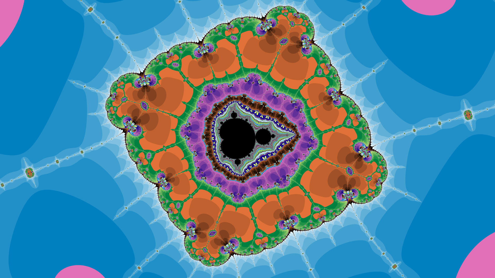

# Mandelbrot Viewer

This program is a Mandelbrot Viewer that allows you to explore the famous Mandelbrot set and its variations interactively. It uses the `minifb` library for window display and keyboard input.







## Features

- Zoom in and out of the Mandelbrot set using the 'Q' and 'E' keys, respectively.
- Pan the view using the 'W', 'A', 'S', and 'D' keys for up, left, down, and right, respectively.
- Toggle different post-processing effects using specific keys:
  - 'O' key: Toggle black and white rendering.
  - 'U' key: Toggle grayscale rendering.
  - 'I' key: Toggle inverted colors.
  - 'K' key: Toggle color clamping.
  - 'X' key: Shift color palette upwards.
  - 'Z' key: Shift color palette downwards.
  - 'F' key: Increase color scaling.
  - 'C' key: Decrease color scaling.
- Adjust the number of iterations used for rendering using the 'T' and 'G' keys for increasing and decreasing iterations, respectively.
- Reset the viewer and post-processing settings using the '1' key.
- Take a screenshot of the current view using the 'P' key (saves as a 1920x1080 image with 4x supersampling).

## Usage

1. Clone or download this repository.
2. Make sure you have Rust installed on your system.
3. Run the program:
   ```bash
   cargo run --release
   ```
4. The window will open, displaying the Mandelbrot set. Use the listed keyboard commands to interact with the viewer.

## Contributing

Feel free to contribute to this project by opening issues, suggesting improvements, or creating pull requests. Any feedback and contributions are welcome!

## License

This program is open-source and distributed under the [MIT License](LICENSE). Feel free to use, modify, and distribute it in accordance with the license terms.